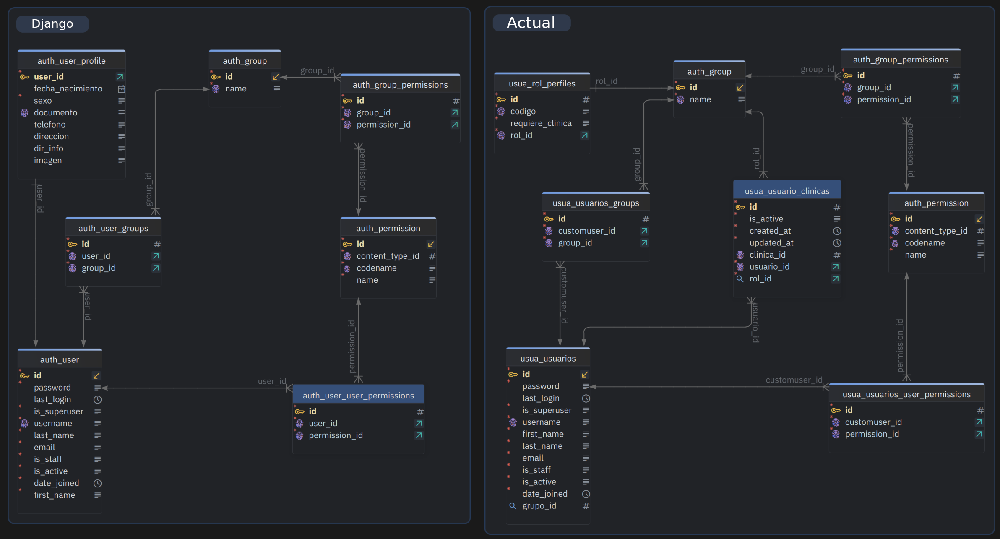

El context processor `apps.usuarios.context_processors.usuario_context` ya inyecta `perms` (dict `{codename: True}`) en todas las templates. Usamos directamente `` en el sidebar sin necesidad del template tag `tiene_permiso_o_staff` ni de la variable `permiso_editar`.

### Mapeo de secciones → permisos

| Sección/Enlace            | Permiso                                                      |
| ------------------------- | ------------------------------------------------------------ |
| Organización (contenedor) | perms.groups.view OR perms.clinics.view OR perms.specialties.view |
| → Grupos                  | perms.groups.view                                            |
| → Clínicas                | perms.clinics.view                                           |
| → Especialidades          | perms.specialties.view                                       |
| Pacientes                 | perms.patients.view                                          |
| Médicos                   | perms.doctors.view                                           |
| Usuarios                  | perms.users.manage OR request.user.is_staff                  |

​	

### Estructura del sidebar

```python

    <div class="nav-section-title">Organización</div>
    <div class="nav flex-column">
        
            <a ... href="">Grupos</a>
        
        
            <a ... href="">Clínicas</a>
        
        
            <a ... href="">Especialidades</a>
        
    </div>



    <div class="nav-section-title">Pacientes</div>
    ...pacientes link...



    <div class="nav-section-title">Médicos</div>
    ...médicos link...



    <div class="nav-section-title">Accesos</div>
    ...usuarios link...

```

